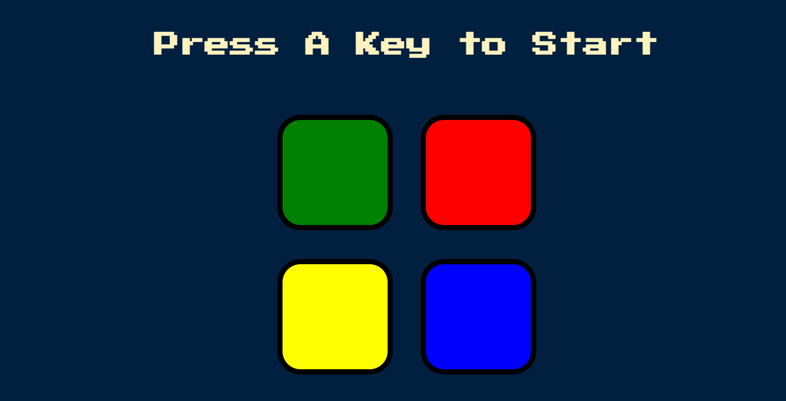
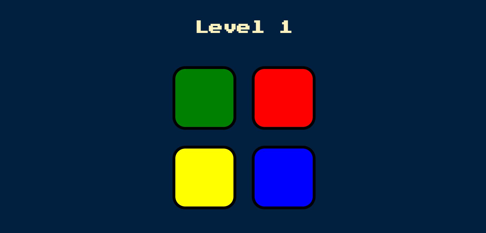
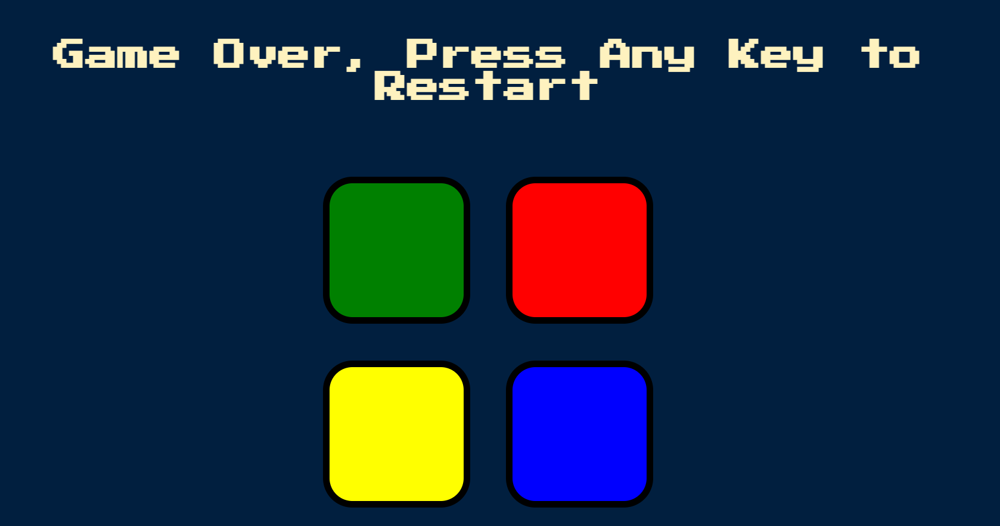

# 🎮 Simon Game

A fun and interactive memory game built with HTML, CSS, and JavaScript!  
Test how good your memory is by repeating an increasingly complex sequence of colors.

---

## 🕹️ How to Play

1.  Press any key to begin the game.
2. The game will flash a random color in a sequence.
3. **Your task:** Repeat the sequence by clicking the correct color buttons.
4. Each round adds a new color to the sequence.
5. If you click the wrong button, the game ends.

**Goal:** Try to remember and match the sequence for as long as possible!

---

## 🚀 Technologies Used

- HTML5
- CSS3
- JavaScript 
- Git & GitHub
- GitHub Pages (for hosting)

---
## 📅 Project Deployed On

**Date:** July 4, 2025  
**Live Link:** [Click here to play the Simon Game](https://shruthipillala.github.io/simon-game/)

## 📸 Screenshot

### Game Start

### Pattern Display

### Game Over

